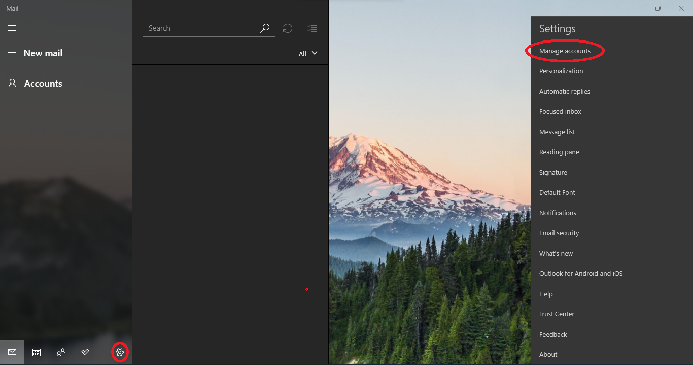
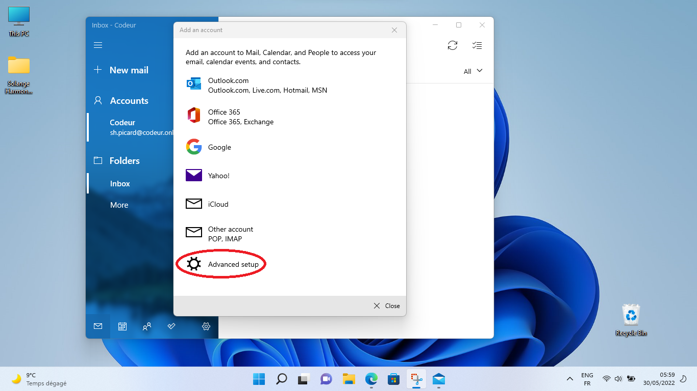

# DWWM DIJON 2022 - Configuration de l'environnement de travail

> ⚠️ J'ai utilisé une adresse d'exemple, « sh.picard@codeur.online » pour rédiger ce tuto. N'essayez pas de me contacter via cette adresse mail : je ne la consulterai pas. Si vous avez besoin de communiquer avec moi par mail, écrivez à « **s.picard@codeur.online** ».

## Le Webmail Codeur Online

- Dans la barre d'adresse de votre navigateur Microsoft Edge, tapez `https://mail.codeur.online/roundcube/`.  Vous arrivez sur une page de *warning*, ce n'est pas grave, cliquez sur `Advanced` :

- Puis sur « `Continue to mail.codeur.online (unsafe)` » : 

- Vous arrivez sur la page de *Login*, connectez-vous avec les informations de connexion qui vous ont été communiquées : 

- Si tout ce passe bien, vous arrivez sur cette page :

> Utilisez cette adresse pour toutes vos communications liée à la formation, pour vous inscrire à des Web Services, etc. : l'idée est de séparer au maximum votre vie professionnelle de votre vie privée.
>
> BONUS : Cette adresse email restera valable une fois la formation terminée, c'est une adresse qui fait « pro », à privilégier quand vous postulez pour un stage ou pour un emploi. 

## Transformez votre adresse Codeur Online en compte Microsoft

> Tout au long de la formation, vous travaillerez sur un environnement Windows. Autant tirer partie au maximum des services et outils proposés par Microsoft.

- Dans la barre d'adresse de votre navigateur Microsoft Edge, tapez `https://account.microsoft.com/account/` et choisissez « `Create account` » :

- Renseignez votre adresse Codeur Online :

- Vous devez créer un nouveau mot de passe, vous n'êtes pas obligé d'utiliser celui du service Codeur Online :

- ⚠️ Pour des raisons de sécurité, refusez l'enregistrement des mots de passe dans le navigateur. Nous découvrirons plus tard une solution pour gérer ses mots de passe de façon réellement *safe* :

- Vous devez entrer un code reçu sur votre adresse Codeur Online, allez le récupérer : 

- Et renseignez-le :

- Microsoft a besoin de quelques informations sur vous. Dans une perspective professionnelle, on évite les « jeux de rôle » (ce ne sont pas des informations très sensibles, par contre gérer son identité numérique est un vrai sujet qu'on abordera en cours de formation !) :

- Acceptez de rester connecté, vous utiliserez ce compte pour vous faire identifier par le navigateur, ce qui permettra la synchronisation sur d'autres appareils au besoin :

- Vous pouvez personnaliser un peu votre compte Microsoft (n'y passez pas trop de temps quand même) :

## Identifiez-vous sur votre session ACS avec votre Compte Microsoft

> Cette fonctionnalité est très utile pour compartimenter vie professionnelle et vie privée : vous pourrez créer une session Windows sur une votre machine personnelle, et utilisez OneDrive pour synchronier votre session entre vos machines.

- Dans le menu `Démarrer` de Windows 11, tapez `Settings` ou `Paramètres` :

- Dans « `Comptes` », choisissez « `Vos informations` » :

- Cliquez sur « `Se connecter avec un compte Microsoft` »

- Vous devrez entrer votre adresse Codeur Online :

- Puis le mot de passe de votre compte Microsoft que vous avez paramétré précédemment (qui peut donc être différent du mot de passe Codeur Online) :

- Enfin, tapez le mot de passe de la session Windows 11 actuelle :

- Vous recevez un mail sur votre adresse Codeur Online : 

## OneDrive

- Le mail contient un lien vers OneDrive, cliquez sur ce lien : 

- Vous serez invité à renseigner une adresse email : utilisez l'adresse Codeur Online et choissez de vous identifier, et non de créer un compte Microsoft, puisque vous l'avez déjà fait...

- Choisissez ensuite « Usage personnel » : 

- Renseignez le mot de passe de votre compte Microsoft :

- Inutile d'envoyer des données supplémentaires : 

- Conservez la config par défaut pour l'emplacement de OneDrive :

- Déselctionnez la synchronisation du « Bureau » : 

- Ne choisissez pas par l'offre Premium : 

- Et... vous pouvez télécharger l'app mobile si vous le souhaitez, mais aucune obligation !

- Vous pouvez accéder à votre dossier OneDrive depuis votre session Windows 11, et depuis n'importe où dans un navigateur !

## L'application Microsoft Courier

- Dans le menu « `Démarrer` » de Windows 11, tapez « `Mail` » ou « `Courier` » :

> Ne tenez pas compte du changement de couleur de l'interface, c'est juste que les *screenshots* n'ont pas été réalisés le même jour.

- ⚠️ L'application peut avoir créé un compte mail sur la base du compte Microsoft. ** Il ne fonctionne pas ! (et ne fonctionnera jamais).** On va donc voir comment le supprimer. Vous vous retrouvez avec quelque chose comme ça , cliquez sur la roue crantée en bas à gauche: 
  

- Choisissez `Gérer les comptes` :

- Cliquez sur votre compte Microsoft que vous devez supprimer, puis sur `Supprimer le compte` :

- Confirmez : 

- Vous vous retrouvez avec une interface vierge. On va pouvoir commencer : 

- Retournez dans `Gérez les comptes` :

- Choisissez `Ajouter un compte` : 

- Choisissez « `Configuration avancée` » :

- Puis l'**option qui permet de configurer les protocoles `POP3` ou `IMAP`** :

- Renseignez l'adresse Codeur Online, qui est aussi le nom d'utilisateur. Cette fois, **c'est bien le mot de passe du Webmail Codeur Online**, et non celui du compte Microsoft. Reproduisez la configuration suivante, en personnalisant avec vos informations :

- Pour le serveur entrant, tapez `mail.codeur.online:110` et choisissez `POP3`, pour le serveur sortant, tapez `mail.codeur.online:587`, et enfin, cochez toutes les cases, sauf le protocole SSL pour les mails entrant :

- Vous aurez un beau message de succès MAIS... ce n'est malheureusement pas aussi simple que ça !

- Normalement, la boîte de réception a dû se remplir. Sinon c'est que vous avez raté quelque chose :

- Essayez de vous envoyer un mail à vous même :

- Il reste bloqué dans la boîte d'envoi (cliquez sur « `Plus` » et ajoutez les autres boîtes en « favoris » pour qu'elle s'affichent). Faites un clic droit sur le nom de votre compte, et choisissez `Paramètres du compte` :

- Choisissez `Changer les paramètres de synchronisation` :

- Cliquez sur `Paramètres avancés` : 

- Vous constaterez que l'application a rajouté toute seule des `:0` et `:1` après les ports dans les champs `Serveur de courier entrant` et `serveur de courier sortant`. Supprimez-les pour que ça redevienne ce que nous avions paramétré précédemment, à savoir `mail.codeur.online:110` et `mail.codeur.online:587` :

- Il vous demande de sauvegarder les paramètres :

- Puis il vous affiche un bandeau vous disant qu'il faut ré-entrer le mot de passe, c'est bien toujours le mot de passe du webmail Codeur Online : 

- Ce n'est pas encore fini... Retournez dans les paramètres (la roue crantée en bas à gauche), choisissez `Gérer les comptes`, cliquez sur le nom de votre compte, puis retourner dans `Modifier les options de synchronisation`. Et là, il va falloir mettre `Option de Synchronisation` > `Messagerie électronique` sur `Off` (puis appuyez sur `Terminer`, `sauvegarder`) :

- Actualisez le Courier. Un symbole « Warning » indique que la synchronisation ne se fait pas. Cliquez dessus : 

- Dites que vous voulez faire confiance à ce serveur :

- Il va vous répondre qu'il y a un problème. C'est normal : 

- Fermez l'application et relancez-là ! Vous constatez que vous avez enfin reçu le mail que vous vous êtes envoyé :

- Vous pouvez vous envoyer un second mail pour confirmer que tout va bien :

> 🎉 Vous avez réussi ! C'est terminé pour ce tuto ! 🥳
